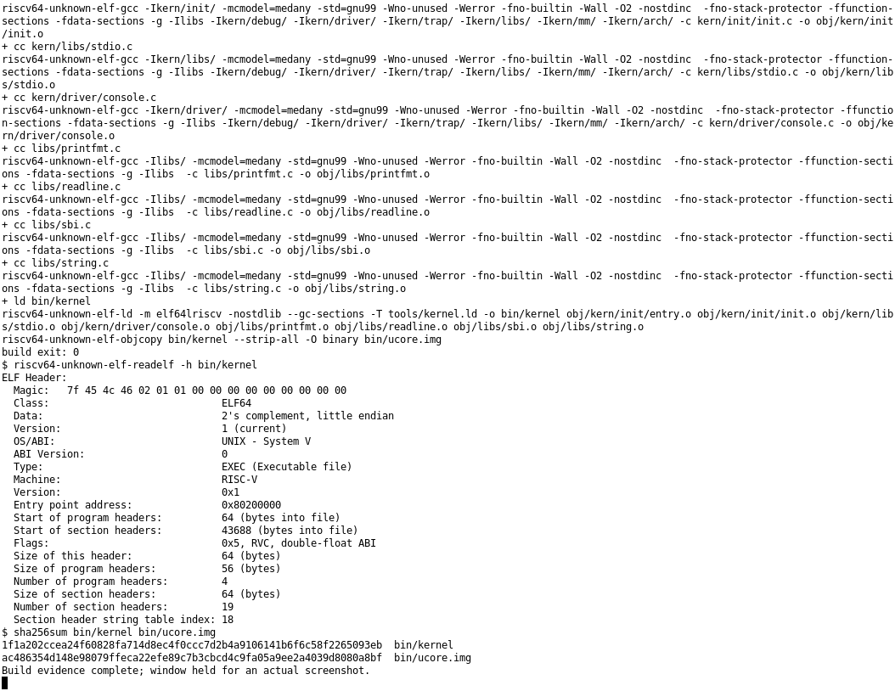
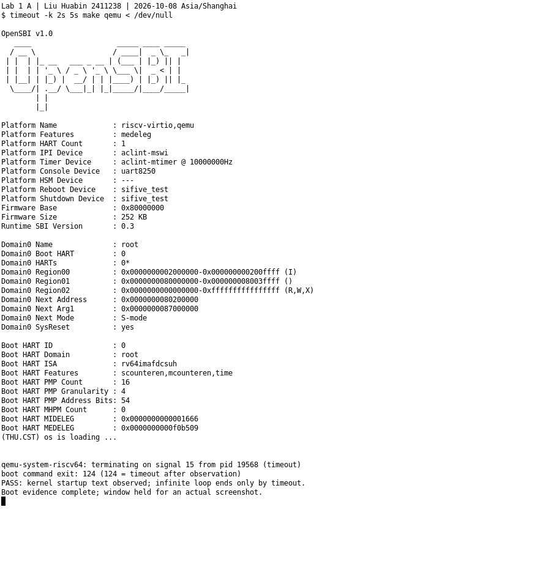

# 操作系统实验报告

> 阶段稿：A（刘华彬，2411238）的构建、链接与镜像成果已整合；B/C 的模块、练习、成员资料及全组总结待补充。本报告中的“本轮”验证数据指 A 于 2026-10-08 完成的取证，本次文档整合没有重新执行实验。
>
> 继续实验请先读 [代码 README](../code/README.md) 和 [A 交接记录](A-构建链接交接.md)；原始分析保留在 [A 报告片段](fragments/A-构建链接与镜像.md)。

## 实验基本信息

| 项目 | 内容 |
|------|------|
| **实验名称** | Lab 1：最小可执行内核与启动流程 |
| **小组成员** | 2411238-刘华彬；B/C 成员信息待填写 |
| **完成日期** | 待填写全组实际完成日期；A 模块验证日期为 2026-10-08 |

### 小组分工

| 成员 | 负责模块/练习 | 报告分工 |
|------|---------------|----------|
| 2411238-刘华彬（A） | 构建、链接与内核镜像 | 自己的模块分析、验证与总结 |
| B（学号姓名待填写） | 内核入口、C 初始化，练习 1 | 自己的模块、练习答案和验证 |
| C（学号姓名待填写） | 固件启动、SBI 输出，练习 2 | 自己的模块、练习答案和验证 |

按 A→B→C 依次完成各自模块与个人报告，最后共同整合修改。

---

## 一、实验目的

Lab 1 围绕最小内核的构建、启动和输出展开，目标包括：

1. 理解交叉编译、重定位、链接布局以及 ELF 到裸镜像的转换，用构建、字节比较与入口断点验证产物可运行（A 已完成）。
2. 理解入口设置内核栈、转入 C 初始化及 BSS 清零的过程，完成练习 1（B 待完成）。
3. 跟踪复位到内核的控制权交接，理解 OpenSBI 服务与格式化输出，完成练习 2（C 待完成）。

---

## 二、实验环境

A 的验证代码位于 `/home/liu/projects/nku-os/labs/code`，内层仓库分支为 `lab1`，验证起点提交为 `55fd23080d86f0612db463a1ac417ea2dbadfc09`。A 开始验证时内层工作区干净；环境准备阶段的 Makefile 启动适配已经包含在该提交中。A 仅分析与验证，没有改动内核实现。本报告中的绝对路径记录原机器环境，朋友在自己的机器上按 [README](../code/README.md#环境配置) 配置即可。

| 工具 | 本轮实际版本 | 用途 |
|---|---|---|
| GNU Make | 4.3 | 组织构建和依赖 |
| RISC-V GCC | 15.1.0，g1b306039ac4 | 编译 C、预处理并汇编 `.S` |
| GNU ld / objcopy | Binutils 2.45 | 链接 ELF、转换裸镜像 |
| RISC-V GDB | 16.3.90.20250610-git | 加载 ELF 符号，验证镜像与入口 |
| QEMU | 7.0.0 | 模拟 RISC-V virt 平台 |
| 默认 OpenSBI | 1.0，Runtime SBI 0.3 | 固件初始化及 S 模式交接 |

工具链根目录为 `/home/liu/.local/opt/riscv-elf-toolchains`，QEMU 从 `/home/liu/.local/bin/qemu-system-riscv64` 调用。非交互终端先执行 `source /home/liu/projects/nku-os/scripts/env.sh`。精确路径及版本见 [本轮汇总](evidence/build-link-20261008/summary.json)。

A 使用的 AI 工具为 Codex，底层模型按 A 会话声明记录为 GPT-6。A 模块属于分析与验证成果，已有代码不作为新实现记录；B/C 工具与模型按各自实际使用情况补充。

### 全组 AI 工具记录

| 成员 | AI 工具 | 底层模型 | 备注 |
|------|---------|----------|------|
| A：刘华彬 | Codex | GPT-6（现有实际记录） | 构建链接模块分析与验证 |
| B | 待填写 | 待填写 | 按实际使用记录 |
| C | 待填写 | 待填写 | 按实际使用记录 |

---

## 三、实验整体逻辑分析

### 3.1 本章节的逻辑主线

实验首先要确定内核的内存布局，否则编译出的地址引用无法与运行时的位置对应；随后把入口、初始化和输出等模块编译为目标文件，由链接器解析符号和重定位；再去掉 ELF 元数据生成裸镜像，由 QEMU 加载、OpenSBI 移交控制权，最终进入内核并打印信息。

```text
源码 .c / .S
  → GCC 编译、汇编 → obj/ 下的 .o（可重定位 ELF）
  → ld -T tools/kernel.ld → bin/kernel（可执行 ELF）
  → objcopy --strip-all -O binary → bin/ucore.img（裸镜像）
  → QEMU -kernel 加载到 0x80200000
  → OpenSBI 交接 → kern_entry → kern_init → 输出 → 无限循环
```

这里要分清宿主机的构建工具与客体内核：GCC、ld 和 QEMU 在宿主 Linux 上执行，生成的机器码则由模拟的 RISC-V CPU 执行。内核的 `<stdio.h>` 来自项目 `libs`，不是宿主 glibc 的头文件。

### 3.2 功能的逐步衔接

1. 构建与链接先安排运行地址、解析模块引用并生成镜像，使 CPU 能找到入口（A 已验证）。
2. 汇编入口建立栈，C 入口接续初始化，给后续函数调用和输出准备环境（B 待独立分析验证）。
3. 固件完成交接，内核通过 SBI 输出启动信息，形成从启动到可见结果的闭环（C 待完整跟踪验证）。

后续由 B 补充入口建立 C 环境的逻辑，由 C 补充固件交接及输出链，最后三人共同统一本节内容。

---

## 四、实验内容与实现

### 功能模块 A：构建、链接与镜像

**负责人：** 刘华彬，2411238。

#### 模块接口与职责

本模块没有需要新增的 C 函数，核心接口是构建目标、Make 宏和链接配置。

| 文件或接口 | 职责 |
|---|---|
| `Makefile`：`TARGETS`、`bin/kernel`、`bin/ucore.img` | 默认构建、链接和镜像转换 |
| `Makefile`：`qemu`、`debug`、`gdb` | 运行镜像及连接调试器 |
| `tools/function.mk`：`listf`、`add_files`、`cc_template` | 搜集 `.c/.S`，生成 `.o/.d` 规则 |
| `tools/function.mk`：`totarget`、`finish_all` | 将目标放入 `bin/`，建立生成目录 |
| `tools/kernel.ld`：`OUTPUT_ARCH`、`ENTRY`、`SECTIONS` | 指定架构、ELF 入口与各段布局 |
| `kern/init/entry.S`：`kern_entry`、`bootstack`、`bootstacktop` | 给链接器提供入口和栈区符号 |
| `kern/init/init.c`：`kern_init()` | 使用链接符号，接续初始化和输出 |

#### 1. 编译和依赖关系

Makefile 搜集 `libs` 和 `kern/init`、`kern/libs`、`kern/driver` 等目录中实际存在的 `.c/.S` 文件。当前完整构建包含 8 个源文件：`entry.S`、`init.c`、`stdio.c`、`console.c`、`printfmt.c`、`readline.c`、`sbi.c`、`string.c`。Makefile 保留的 `kern/debug`、`kern/trap` 等目录名没有对应源文件，不代表本轮实现了这些模块。

`cc_template` 使用 GCC `-MM` 生成头文件依赖 `.d`，使用 `-c` 生成 `.o`。大写 `.S` 会先经过 C 预处理，因此能展开 `PGSHIFT`、`KSTACKSIZE` 等宏。对象文件中的符号和重定位还没有完成最终地址解析；[entry.o 证据](evidence/build-link-20261008/object.log)显示其类型为 `REL`，包含对 `bootstacktop` 和 `kern_init` 的重定位。

关键选项的作用：

- `-mcmodel=medany` 配合 RISC-V 地址生成；它不能替代正确的链接和加载地址，也不能据此宣称整个内核可以任意搬移。
- `-nostdinc`、`-fno-builtin` 和链接时的 `-nostdlib` 使构建使用项目头文件与实现，不自动依赖宿主标准库。
- `-O2 -g` 同时启用优化和调试信息；源码函数可能被内联，不能假设每个源码调用都有同名最终符号。
- `-ffunction-sections -fdata-sections` 与 `--gc-sections` 配合，让未被保留路径引用的输入段可以被删除。

本轮再次执行 `make` 得到 `Nothing to be done for 'TARGETS'`。用 `make -n -W kern/mm/mmu.h` 模拟头文件更新，会计划重新编译入口、重新链接并生成镜像；用 `make -n -W tools/kernel.ld` 模拟链接脚本更新，只计划重新链接和生成镜像。这是干运行观察，没有修改源文件时间戳。见 [增量构建](evidence/build-link-20261008/incremental.log)、[头文件依赖](evidence/build-link-20261008/header-dependency.log)、[链接脚本依赖](evidence/build-link-20261008/linker-dependency.log)。

教材附录把 `#ifndef GCCPREFIX` 描述为条件判断，但实际 GNU Make 中这一行是注释；这里的 `GCCPREFIX := riscv64-unknown-elf-` 是普通赋值。本轮使用默认前缀，不修改该处。

#### 2. 链接：解析引用并安排地址

本轮真实链接命令为：

```bash
riscv64-unknown-elf-ld -m elf64lriscv -nostdlib --gc-sections \
  -T tools/kernel.ld -o bin/kernel \
  obj/kern/init/entry.o obj/kern/init/init.o \
  obj/kern/libs/stdio.o obj/kern/driver/console.o \
  obj/libs/printfmt.o obj/libs/readline.o obj/libs/sbi.o obj/libs/string.o
```

`OUTPUT_ARCH(riscv)` 指定输出架构，`. = BASE_ADDRESS` 从 `0x80200000` 开始布置，`ENTRY(kern_entry)` 将入口符号的值写入 ELF 入口字段。`*(...)` 是输入段选择规则，不是 C 函数调用。

**`ENTRY` 不负责把函数移到镜像开头。** 当前 `entry.S` 把入口放在普通 `.text`，而链接对象列表中 `entry.o` 位于首位；[本轮链接 map](evidence/build-link-20261008/kernel.map)证明其 `.text` 占据输出 `.text` 开头的 10 字节，所以 `kern_entry` 确实为 `0x80200000`。未来若改变对象顺序或入口段，必须重新验证，不能只看 `ENTRY`。

本轮内存布局如下，范围均为左闭右开：

| 区域 | 起始地址 | 结束地址 | 大小 | 含义 |
|---|---|---|---|---|
| `.text` | `0x80200000` | `0x802004a2` | `0x4a2`，1186 字节 | 可执行指令 |
| `.rodata` | `0x802004a8` | `0x80200718` | `0x270`，624 字节 | 字符串和常量 |
| `.data` | `0x80201000` | `0x80203000` | `0x2000`，8192 字节 | 当前主要为预留内核栈 |
| `.sdata` | `0x80203000` | `0x80203008` | 8 字节 | 保留的 SBI 输出服务号 |
| `.bss` | `0x80203008` | `0x80203008` | 0 字节 | 本轮没有非空输出 BSS 段 |

`ALIGN(0x1000)` 按 4096 字节对齐，不是按 `2^0x1000` 对齐。它安排地址，不会启用分页或内存分配器。

`readelf -l` 显示两个 `PT_LOAD`：一个包含 `.text/.rodata`，一个包含 `.data/.sdata`，其虚拟地址与物理地址相同。本轮没有需要搬运到另一个运行地址的初始化段。Section 用于组织链接和调试，Program Header 中的 Segment 用于描述 ELF 的装载；当前实际运行的却是转换后的裸镜像。

本轮 `bootstack=0x80201000`，`bootstacktop=0x80203000`，`kern_init=0x8020000a`，`edata=end=0x80203008`。`etext` 使用 `PROVIDE` 定义规则，但没有被引用，本轮符号表中未出现该符号；不能将脚本中的每个 `PROVIDE` 都写成实际已导出的符号。

诊断链接使用相同对象和链接参数，额外生成 map 和段删除日志，输出放在临时目录，没有替换正常产物；其 ELF 字节与正常构建完全相同。[段删除日志](evidence/build-link-20261008/link-diagnostic.log)显示 `.bss.buf`、`.sbss.SBI_SET_TIMER` 等被删除，解释了本轮 BSS 为空的原因。

当前 `cons_getc` 引用了未实现的 `sbi_console_getchar`，但输入路径没有被启动路径使用，其 `.text.cons_getc` 已被删除。最终 `nm -u bin/kernel` 无输出，证明当前保留路径没有未解析符号；这不能证明输入功能已经完整。最终 ELF 的 `readelf -r` 也显示没有剩余重定位。

#### 3. ELF 与裸镜像

```bash
riscv64-unknown-elf-objcopy bin/kernel --strip-all -O binary bin/ucore.img
```

| 项目 | `bin/kernel` | `bin/ucore.img` |
|---|---|---|
| 本轮大小 | 44904 字节 | 12296 字节，`0x3008` |
| 格式 | ELF64、小端、RISC-V、EXEC | 无 ELF 头的裸二进制 |
| 内容 | 程序内容及段表、符号、调试信息等 | 本轮可加载段内容及地址间隙 |
| 入口信息 | ELF 字段为 `0x80200000` | 没有入口字段，依赖加载与固件交接约定 |
| 用途 | GDB 符号与静态分析 | QEMU 的 `-kernel` 输入 |

GNU objcopy 本地手册说明，binary 输出从最低被复制段的加载地址开始。它不是简单删除 ELF 文件前若干字节，也不是完整磁盘或文件系统镜像。

本轮根据 ELF 段表重建 `.text/.rodata/.data/.sdata` 及其零填充间隙，与 `ucore.img` 的**全部 12296 字节逐一比较，一致**。对本轮镜像，文件偏移等于地址减去 `0x80200000`：入口位于偏移 0，栈区位于 `0x1000`，SBI 服务号位于 `0x3000`，末端为 `0x3008`。ELF `.text` 的文件偏移却为 `0x1000`，因此 ELF 文件偏移与镜像偏移不可混淆。

教材关于 bin 文件有加载地址头、零初始化数组必然占据同等镜像空间的说法不能直接套到本轮 `objcopy -O binary`。BSS 通常没有文件内容，运行时由内核清零；当前没有非空 BSS。另一方面，本轮栈在 `.data` 中以 `.space` 预留，实际占据了镜像中的 8192 个零字节。

#### 4. 镜像运行与入口验证

当前 Makefile 使用：

```bash
qemu-system-riscv64 -machine virt -nographic -bios default -kernel bin/ucore.img
```

教材示例使用 `-device loader,...`，当前工程此前已经适配为 `-kernel`；本轮没有再次修改。加载镜像与执行镜像是两个阶段：通过 `make debug` 在 CPU 暂停时连接 GDB，实际初始 PC 为 `0x1000`；此时导出的 `[0x80200000, 0x80203008)` 内存已经与本轮镜像逐字节相同。随后在 `0x80200000` 设置硬件断点并继续执行，命中 `kern_entry`，证明固件实际交接到了镜像第一条指令。见 [本轮入口 GDB 记录](evidence/build-link-20261008/entry-gdb.log)。

本轮入口反汇编为：

```text
0x80200000: auipc sp,0x3
0x80200004: mv    sp,sp
0x80200008: j     0x8020000a <kern_init>
```

这里仅用于证明入口位置及链接结果；详细的栈设置与 C 初始化由 B 自己继续验证。完整复位指令分析和 OpenSBI 阶段跟踪仍由 C 完成，不能用本人的入口断点代替练习 2 全部证据。

#### 最终实际提示词

以下为 A 模块实际任务原文，完整追问和答复见 [提示词记录](prompt.md#记录-1a1-构建链接与镜像)。后续补充说明和本次文档整合单独记录，不计作 A 的代码实现迭代。

```text
[PROMPT]
我负责构建、链接和镜像模块。请带我分析并验证源码如何生成可运行内核，完成自己的报告片段。

[RELY]
工作区 /home/liu/projects/nku-os；代码 labs/code。请自行阅读相关手册、Makefile 和链接脚本，探索必要的代码与工具。

[GUARANTEE]
解释构建过程、ELF 与镜像、内存布局和入口地址，提供真实验证依据，交接可供下一位直接使用的稳定工程。

[SPECIFICATION]
Pre-Condition：先读取本次相关材料，确认当前工程状态与负责范围。
Post-Condition：完成上述交付，重要结论有实际依据，未完成项明确标注。
不无故修改实现；结论对应本轮源码和产物。独立完成分析、验证与记录。
```

#### 实际验证与迭代过程

本轮只有一次正式任务提示词，没有代码实现迭代。验证命令有两次普通启动尝试：

1. 首次在 xterm 中用 `timeout ... make qemu | tee ...` 保存输出，得到 124，但日志只有终止消息，没有固件或内核输出，因此判为取证不通过。失败日志保存在 [boot-attempt1.log](evidence/build-link-20261008/boot-attempt1.log)，失败脚本也保留。
2. 改验证脚本，将 QEMU 标准输入改为 `/dev/null`，同样的源码和镜像成功输出 OpenSBI 与内核信息，并保存真实截图。未获取首次尝试的停止信号，因此“终端输入与管道交互导致停滞”是结合对比得到的原因推断，不能写成已证实的具体信号。

证据收尾时还有一次进程检查辅助命令异常：将 `pgrep` 的“没有匹配进程”返回码 1 当成了 Python 异常，并且短进程名匹配不适合 QEMU 的长名称；最终改用 `/proc` 中完整命令行检查清理结果。该异常没有使构建或入口验证失败，也未改动内核。

### 功能模块 B：内核入口与 C 初始化

**负责人：** B，学号姓名待填写。

阅读起点：[entry.S](../code/kern/init/entry.S)、[init.c](../code/kern/init/init.c)、[栈定义](../code/kern/mm/memlayout.h)。

#### 模块功能与核心接口（待 B）

待分析 `kern_entry`、`kern_init()`、链接符号与栈区的关系；区分预留栈和设置 SP，以及源码伪指令与本机实际展开。

#### 独立验证依据（待 B）

待保存自己的符号/反汇编、入口单步、SP 与 `bootstacktop` 对照，以及 C 初始化观察；提供日志路径和真实截图。

#### 最终实际提示词与真实迭代（待 B）

待追加到 `prompt.md` 并在此说明实际过程；若没有修改实现，如实记录分析与验证，不人为制造代码迭代。

### 练习 1：理解内核启动中的程序入口操作

**负责人：** B。

待回答 `la sp, bootstacktop` 和 `tail kern_init` 分别完成什么、目的是什么，并提供自己的静态和动态依据。A 的入口验证仅用于构建交接，不代替 B 的练习答案。

### 功能模块 C：固件启动与 SBI 输出

**负责人：** C，学号姓名待填写。

阅读起点：[SBI 封装](../code/libs/sbi.c)、[控制台](../code/kern/driver/console.c)、[内核 stdio](../code/kern/libs/stdio.c)、[格式化实现](../code/libs/printfmt.c)。

#### 模块功能与核心接口（待 C）

待分析复位代码、OpenSBI 和内核的控制权交接，以及 `cprintf` 到 `ecall` 的实际输出链与特权级。

#### 独立验证依据（待 C）

待保存从复位开始的指令观察、固件与入口断点、输出链证据和真实截图；镜像加载与 CPU 执行须分开描述。

#### 最终实际提示词与真实迭代（待 C）

待追加到 `prompt.md` 并在此记录实际过程；监视点未触发时核对初始内存，不预设“固件执行期间一定加载镜像”。

### 练习 2：使用 GDB 验证启动流程

**负责人：** C。

待完整跟踪复位到内核第一条指令，回答最初指令的地址与功能，并记录调试过程、观察结果和真实截图。

---

## 五、测试与验证

本节已填内容来自 A 的实际源码与重建产物；本次只整合已有证据，没有重新编译、运行或生成截图。B/C 完成后在对应位置补充各自证据。

| 检查 | 本轮结果 | 证据 |
|---|---|---|
| 清理生成目录后完整构建 | 成功，退出码 0 | [clean.log](evidence/build-link-20261008/clean.log)、[build.log](evidence/build-link-20261008/build.log) |
| ELF 架构、入口、段和符号 | ELF64 RISC-V，入口 `0x80200000` | [elf.log](evidence/build-link-20261008/elf.log)、[symbols.log](evidence/build-link-20261008/symbols.log) |
| 镜像与 ELF 内容 | 全字节一致 | [verify.py](evidence/build-link-20261008/verify.py)、[summary.json](evidence/build-link-20261008/summary.json) |
| 同参数诊断链接、镜像转换 | 与原产物字节一致 | [链接日志](evidence/build-link-20261008/link-diagnostic.log)、[转换日志](evidence/build-link-20261008/objcopy-repeat.log) |
| 复位时已加载镜像、实际入口断点 | 全镜像内存一致，PC 到达 `0x80200000` | [entry-gdb.log](evidence/build-link-20261008/entry-gdb.log) |
| 普通启动 | Next Address 正确、S-mode、有内核输出 | [boot.log](evidence/build-link-20261008/boot.log) |
| 无变更再次 make | 不重新构建 | [incremental.log](evidence/build-link-20261008/incremental.log) |
| 实现文件是否变化 | 所有受版本管理的 code 文件 SHA-256 前后一致 | [前快照](evidence/build-link-20261008/source-before.json)、[后快照](evidence/build-link-20261008/source-after.json) |

下面两张图片均使用 ImageMagick `import -window` 捕获本轮执行命令的实际 xterm 窗口，没有将日志渲染成截图。完整命令和未显示在窗口内的输出由文本日志保留。





普通启动使用 `timeout -k 2s 5s make qemu < /dev/null`，在观察到内核输出后自动结束；退出码 124 表示超时，不是正常退出码，也不能单凭它判定启动成功。成功依据是 Next Address、S-mode、内核输出与独立入口断点。

### 尚待补充的验证

B：入口栈设置与 C 初始化的独立观察。C：初始指令、OpenSBI 与内核入口的完整跟踪。新增截图放入 `images/`，用相对链接引用。

当前未提供 `tools/grade.sh`，没有执行评分测试，不宣称评分通过。

---

## 六、实验总结与收获

### 与 OS 原理的联系

| 知识点 | 本实验中的含义 | 与 OS 原理的联系和差异 |
|---|---|---|
| 程序地址空间与装载 | 链接器安排指令和数据，QEMU 按约定加载裸镜像 | 地址布局不等于地址转换；本轮没有实现页表或虚拟内存管理 |
| 链接与重定位 | `.o` 中的符号引用在链接阶段解析 | 它发生在构建时，与运行时缺页、调度不同 |
| 启动与特权级 | 固件初始化后把控制权交给 S 模式内核 | 内核必须依靠前一阶段建立环境，不能像普通程序那样由宿主运行时直接启动 |
| 栈与静态存储 | 栈区预留在 `.data`，BSS 边界由链接器定义 | 本轮只有静态启动栈，没有动态堆分配或每进程独立栈管理 |
| 调试符号与运行内容 | ELF 保留符号，裸镜像保留运行字节 | 符号帮助 GDB 解释机器码，但不是 CPU 执行所需的 ELF 元数据 |

OS 原理中重要但本模块尚未涉及的内容包括进程调度、地址空间隔离、物理内存分配、文件系统、设备中断与并发同步。当前镜像只是最小启动内核，不能将构建成功写成这些功能已实现。

### AI 协作记录与个人核对

本轮协作过程体现了先阅读实际文件、再执行验证、最后写报告的顺序。源码与教材的差异、BSS 为空、入口对象顺序和取证失败都根据证据说明，没有要求 AI 为了“完成实现”增加无关代码。以上是可核实的协作记录；个人学习感悟由负责人审阅后补充。

负责人可用以下问题自检，避免只记结论：

- 为什么只写 `ENTRY(kern_entry)` 仍不足以保证裸镜像入口正确？
- 为什么 ELF 的 `.text` 文件偏移为 `0x1000`，而镜像中的入口偏移为 0？
- 为什么本轮栈占据镜像字节，BSS 却为空？
- 为什么没有输入函数实现，当前保留的输出路径仍能链接？

### B/C 与共同总结

待各成员补充自己的 OS 原理联系、未覆盖知识和 AI 协作收获，最后共同审阅。个人感悟由本人确认，不由现有技术日志替代。

## 待完成与交付检查

| 项目 | 状态 | 后续动作 |
|---|---|---|
| A 构建、链接、镜像 | 已验证并整合 | 保留本轮日志和截图，修改源码后另存新证据 |
| B 模块与练习 1 | 待完成 | 补成员信息、分析、独立验证和实际提示词 |
| C 模块与练习 2 | 待完成 | 补完整启动跟踪、输出链、独立日志和截图 |
| 全组总结与基本信息 | 待完成 | 补 B/C 工具模型、全组完成日期与总结 |
| 评分测试 | 未执行，缺少 `tools/grade.sh` | 如老师提供脚本，再取得真实结果 |
| 仓库提交与推送 | 本次未执行 | 全组完成并核对后按课程要求交付 |

Lab 1 文档未列正式 Challenge，本报告不新增该项。新增日志保存到 `report/evidence/` 的成员或轮次目录，截图保存到 `report/images/`，使用相对链接；不要覆盖 A 的原始证据。
